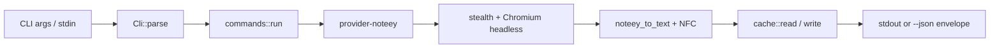

# Architecture — youtube-legend-cli

Last reviewed: 2026-06-23 (audit v0.3.3)
Scope: high-level view of the crate, intended for newcomers and
LLM-assisted contributors. The full rustdoc on docs.rs is the
authoritative reference; this file is the map.

## Bird's-eye view

`youtube-legend-cli` is a single-binary CLI that turns a YouTube URL
into a clean subtitle file. It speaks a native Unix `stdin`/`stdout`
contract, exposes a JSON envelope via `--json`, and never blocks on a
TUI or a prompt.

## Module map

| Module | Role | Re-exported at crate root |
|---|---|---|
| `cli` | clap-derived argument parser, `Cli` struct, 17 flags including `--provider` from v0.3.0 | `Cli`, `FormatArg`, `LanguageArg` |
| `commands` | top-level dispatch (`run`, `extract::run`, `batch::run`) | `run` |
| `provider` | `Provider` trait, `ProviderNoteey` (headless Chromium via `chromiumoxide 0.9.1`), `stealth` anti-fingerprint patches, `BrowserFetcher` auto-download | `Provider` only (concrete provider via `provider::*`) |
| `parse` | `extract_video_id`, `noteey_to_text`, and Unicode NFC normalisation | via `parse::*` |
| `cache` | TTL-keyed local file cache at `~/.cache/youtube-legend-cli/` plus browser cache for Chromium | via `cache::*` |
| `retry` | `retry_with_backoff`, `CircuitBreaker` | via `retry::*` |
| `io` | stdin/stdout/TTY helpers | via `io::*` |
| `error` | `AppError`, `AppResult`, `NoSubtitleReason` | `AppError`, `AppResult`, `NoSubtitleReason` |
| `logging` | `init_tracing` (EnvFilter precedence) | via `logging::*` |
| `text` | Unicode NFC normalisation | `pub(crate)` only |
| `secret_endpoints` | upstream hostnames and tokens | `pub(crate)` only (consumed by `src/bin/snapshot.rs` via `#[path = "..."]`) |

## Stream contract

- `stdout` is reserved exclusively for the subtitle body (or the
  `--json` envelope).
- `stderr` is reserved exclusively for logs, progress, and human
  error messages.
- `stdin` accepts a single URL, a batch of one URL per line, or
  `--batch` flag input.

## Provider pipeline

1. `commands::run` dispatches to `extract::run` for a single URL or
   `batch::run` for stdin-driven lists.
2. `ProviderNoteey` launches headless Chromium (via `chromiumoxide`)
   to navigate noteey.com and extract the transcript. The
   `stealth.rs` module patches browser automation signals before
   navigation. `BrowserFetcher` auto-downloads Chromium r1585606
   when no local Chrome/Chromium is found.
3. The raw HTML transcript is cleaned by `parse::noteey_to_text`
   (removes timestamps, speaker markers `>>`, and annotation tags
   like `[Music]`) and normalised to Unicode NFC.
4. A successful fetch writes the cleaned content to the local cache
   and returns it to the output layer as plain text or a JSON
   envelope on `stdout`.

## Cancellation

`SIGINT` and `SIGTERM` are wired through
`tokio_util::CancellationToken` in `main.rs`. In-flight requests are
allowed to complete; the process exits with code 130. The async API
exposed by this crate is cancellation-safe at every public await
point.

## MSRV

`1.88.0` — declared in `Cargo.toml` `rust-version` field. The local
toolchain pinned via `rust-toolchain.toml` may be newer; the MSRV in
`Cargo.toml` is the contract with users.

## See Also

- [README](../README.md) — user-facing entry point
- [CHANGELOG](../CHANGELOG.md) — release history
- [llms.txt](../llms.txt) and [llms-full.txt](../llms-full.txt) —
  LLM-friendly excerpts
- [docs/decisions/](decisions/) — ADRs in MADR format
- [docs/agent-teams-workflow.md](agent-teams-workflow.md) — playbook
  used to deliver v0.2.6
- [docs/COOKBOOK.md](COOKBOOK.md) — recipes for scripting the CLI
- [docs/HOW_TO_USE.md](HOW_TO_USE.md) — day-one operator guide
- [docs/TESTING.md](TESTING.md) — test architecture and gates
- [docs/MIGRATION.md](MIGRATION.md) — upgrade notes per release
