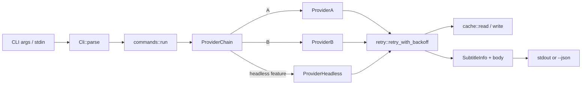

# Architecture — youtube-legend-cli

Last reviewed: 2026-06-14 (audit pre-v0.2.9)
Scope: high-level view of the crate, intended for newcomers and
LLM-assisted contributors. The full rustdoc on docs.rs is the
authoritative reference; this file is the map.

## Bird's-eye view

`youtube-legend-cli` is a single-binary CLI that turns a YouTube URL
into a clean subtitle file. It speaks a native Unix `stdin`/`stdout`
contract, exposes a JSON envelope via `--json`, and never blocks on a
TUI or a prompt.

## Module map

| Module | Role | Re-exported at crate root |
|---|---|---|
| `cli` | clap-derived argument parser, `Cli` struct, 17 flags | `Cli`, `FormatArg`, `LanguageArg` |
| `commands` | top-level dispatch (`run`, `extract::run`, `batch::run`) | `run` |
| `provider` | `Provider` trait, `ProviderA`, `ProviderB`, `ProviderChain`, `provider::robots`, optional `ProviderHeadless` (feature = `headless`) | `Provider` only (concrete providers via `provider::*`) |
| `parse` | `extract_video_id`, `srt_to_text` | via `parse::*` |
| `cache` | TTL-keyed local file cache at `~/.cache/youtube-legend-cli/` | via `cache::*` |
| `retry` | `retry_with_backoff`, `CircuitBreaker` | via `retry::*` |
| `io` | stdin/stdout/TTY helpers | via `io::*` |
| `error` | `AppError`, `AppResult`, `NoSubtitleReason` | `AppError`, `AppResult`, `NoSubtitleReason` |
| `logging` | `init_tracing` (EnvFilter precedence) | via `logging::*` |
| `crypto` | AES-256-CBC + PBKDF2 for provider-B signing | via `crypto::*` |
| `text` | Unicode NFC normalisation | `pub(crate)` only |
| `secret_endpoints` | upstream hostnames and tokens | `pub(crate)` only (consumed by `src/bin/snapshot.rs` via `#[path = "..."]`) |

## Stream contract

- `stdout` is reserved exclusively for the subtitle body (or the
  `--json` envelope).
- `stderr` is reserved exclusively for logs, progress, and human
  error messages.
- `stdin` accepts a single URL, a batch of one URL per line, or
  `--batch` flag input.

## Provider pipeline

1. `provider::robots::check` consults the upstream `robots.txt` and
   short-circuits with `EX_UNAVAILABLE` on `Disallow`.
2. `ProviderChain` walks `ProviderA` then `ProviderB` (and
   `ProviderHeadless` if the `headless` feature is enabled) in
   insertion order, throttled to one request per second.
3. `retry::retry_with_backoff` wraps each call with three attempts
   at 1 s, 2 s, 4 s. The `Retry-After` header is honoured in both
   delta-seconds and RFC 2822 date form, with a 60 s fallback capped
   at 300 s. A `429` response from any provider raises
   `AppError::RateLimited`.
4. A successful `fetch_subtitle` returns a `SubtitleInfo` and a
   body. The body is read back via `fetch_content` and written to
   the user (plain text or SRT) or wrapped in a JSON envelope.

## Cancellation

`SIGINT` and `SIGTERM` are wired through
`tokio_util::CancellationToken` in `main.rs`. In-flight requests are
allowed to complete; the process exits with code 130. The async API
exposed by this crate is cancellation-safe at every public await
point.

## MSRV

`1.88.0` — declared in `Cargo.toml` `rust-version` field. The local
toolchain pinned via `rust-toolchain.toml` may be newer; the MSRV in
`Cargo.toml` is the contract with users.

## Related documents\n\n- [docs/agent-teams-workflow.md](agent-teams-workflow.md) — playbook\n  used to deliver v0.2.6\n- [docs/ARCHITECTURE.md](ARCHITECTURE.md) — high-level view of the\n  crate, intended for newcomers and LLM-assisted contributors\n- [docs/decisions/](decisions/) — ADRs in MADR format

- [README](../README.md) — user-facing entry point
- [CHANGELOG](../CHANGELOG.md) — release history
- [llms.txt](../llms.txt) and [llms-full.txt](../llms-full.txt) —
  LLM-friendly excerpts
- [docs/decisions/](decisions/) — ADRs in MADR format
- [docs/agent-teams-workflow.md](agent-teams-workflow.md) — playbook
  used to deliver v0.2.6
